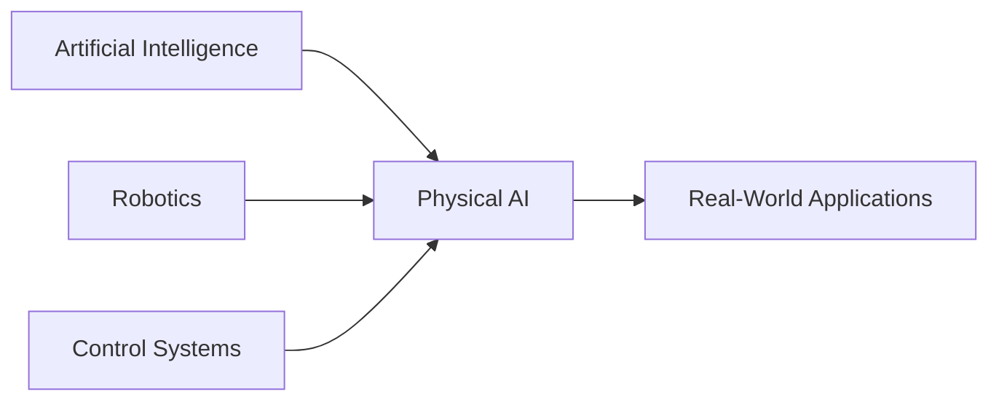

# Introduction to Physical AI

Physical AI is the study of **intelligent systems that interact with the real world** through sensors, actuators, and control mechanisms. Unlike purely software AI, physical AI focuses on tangible, robotic systems that can sense, move, and make decisions in real-time.


## What is Physical AI?

Physical AI combines three key domains:



:::tip Key Concept
**Physical AI** = AI Algorithms + Physical Embodiment + Real-World Interaction
:::

### The Physical AI Stack

| Layer | Description | Examples |
|-------|-------------|----------|
| **Intelligence** | Decision-making algorithms | Neural Networks, Reinforcement Learning |
| **Perception** | Sensing the environment | Cameras, LIDAR, IMU sensors |
| **Actuation** | Physical movement | Motors, Servos, Hydraulics |
| **Integration** | Hardware & Software | ROS, Embedded Systems, Real-time OS |

## Why Physical AI Matters

Physical AI is transforming industries and daily life:

### 🏭 **Industrial Applications**
- Automated manufacturing and assembly lines
- Warehouse robotics and logistics
- Quality control and inspection systems

### 🏥 **Healthcare & Assistance**
- Surgical robots with precision control
- Rehabilitation and therapy robots
- Elderly care and companion robots

### 🚗 **Autonomous Systems**
- Self-driving vehicles
- Delivery drones and autonomous aircraft
- Agricultural automation

### 🏠 **Consumer Robotics**
- Smart home assistants
- Robotic vacuum cleaners
- Educational robotics kits

:::note Real-World Impact
According to recent studies, the global robotics market is expected to reach **$260 billion by 2030**, with physical AI being a major driver of this growth.
:::

## The Evolution of Physical AI

```python
# Timeline of Physical AI Development
milestones = {
    1961: "Unimate - First industrial robot",
    1997: "Deep Blue defeats chess champion",
    2004: "DARPA Grand Challenge - Autonomous vehicles",
    2012: "Deep Learning revolution begins",
    2016: "Boston Dynamics Atlas - Advanced humanoid",
    2020: "GPT-3 + Robotics integration",
    2023: "Foundation models for robotics",
    2024: "Physical AI becomes mainstream"
}
```

## Core Components of Physical AI

### 1. Sensors (Perception)
**Purpose:** Gather information about the environment

```python
# Example: Simple sensor reading
class DistanceSensor:
    def __init__(self):
        self.range = 400  # cm

    def read_distance(self):
        # Simulated sensor reading
        import random
        return random.randint(10, self.range)

sensor = DistanceSensor()
distance = sensor.read_distance()
print(f"Object detected at {distance}cm")
```

### 2. Actuators (Action)
**Purpose:** Execute physical movements

```python
# Example: Motor control
class ServoMotor:
    def __init__(self, pin):
        self.pin = pin
        self.angle = 0

    def set_angle(self, angle):
        self.angle = max(0, min(180, angle))
        print(f"Motor at pin {self.pin} set to {self.angle}°")

servo = ServoMotor(pin=9)
servo.set_angle(90)  # Move to 90 degrees
```

### 3. Control Systems (Decision)
**Purpose:** Process sensor data and command actuators

```python
# Example: Simple PID controller
class PIDController:
    def __init__(self, kp, ki, kd):
        self.kp = kp  # Proportional gain
        self.ki = ki  # Integral gain
        self.kd = kd  # Derivative gain
        self.prev_error = 0
        self.integral = 0

    def compute(self, setpoint, measured_value):
        error = setpoint - measured_value
        self.integral += error
        derivative = error - self.prev_error

        output = (self.kp * error +
                 self.ki * self.integral +
                 self.kd * derivative)

        self.prev_error = error
        return output

# Usage
pid = PIDController(kp=1.0, ki=0.1, kd=0.05)
control_signal = pid.compute(setpoint=100, measured_value=85)
print(f"Control output: {control_signal}")
```

## Learning Outcomes

By the end of this textbook, you will be able to:

✅ **Understand** core concepts of Physical AI and robotics
✅ **Design** sensor and actuator systems for real-world applications
✅ **Implement** control algorithms (PID, MPC, etc.)
✅ **Apply** AI techniques (ML, RL) to physical systems
✅ **Build** complete robotic systems from scratch
✅ **Debug** and optimize physical AI implementations

## Prerequisites

:::caution Before You Begin
This textbook assumes basic knowledge of:
- **Programming:** Python (recommended) or C++
- **Mathematics:** Linear algebra, calculus, basic statistics
- **Physics:** Kinematics, dynamics, basic mechanics
:::

**Recommended Background:**
- Introduction to Programming
- Basic Electronics
- Fundamentals of AI/Machine Learning (helpful but not required)

## Course Structure

```
📚 Physical AI Textbook
│
├── 📖 Chapter 1: Introduction (You are here)
├── 📖 Chapter 2: Physical AI Fundamentals
├── 📖 Chapter 3: Humanoid Robotics
├── 📖 Chapter 4: Sensors & Actuators
├── 📖 Chapter 5: Control Systems
├── 📖 Chapter 6: AI Techniques for Robotics
├── 📖 Chapter 7: Real-World Applications
└── 📖 Chapter 8: Future of Physical AI
```

## Hands-On Example: Your First Physical AI Program

Let's create a simple obstacle-avoiding robot simulation:

```python
import random
import time

class SimpleRobot:
    """A basic robot with distance sensor and motors"""

    def __init__(self):
        self.position = 0
        self.sensor_range = 50  # cm

    def read_sensor(self):
        """Simulate distance sensor reading"""
        return random.randint(5, 100)

    def move_forward(self):
        """Move robot forward"""
        self.position += 1
        print(f"🤖 Moving forward... Position: {self.position}")

    def turn(self):
        """Turn to avoid obstacle"""
        print("🔄 Obstacle detected! Turning...")
        time.sleep(0.5)

    def run(self, steps=10):
        """Main control loop"""
        print("🚀 Starting robot simulation...\n")

        for i in range(steps):
            distance = self.read_sensor()
            print(f"📏 Sensor reading: {distance}cm")

            if distance < self.sensor_range:
                self.turn()
            else:
                self.move_forward()

            time.sleep(0.3)

        print(f"\n✅ Simulation complete! Final position: {self.position}")

# Run the simulation
robot = SimpleRobot()
robot.run(steps=10)
```

**Output:**
```
🚀 Starting robot simulation...

📏 Sensor reading: 78cm
🤖 Moving forward... Position: 1
📏 Sensor reading: 32cm
🔄 Obstacle detected! Turning...
📏 Sensor reading: 91cm
🤖 Moving forward... Position: 2
...
✅ Simulation complete! Final position: 7
```

:::tip Try It Yourself!
Copy the code above and run it on your computer. Experiment with:
- Changing the `sensor_range` value
- Adding more sophisticated obstacle detection
- Implementing different movement patterns
:::

## Key Terminology

| Term | Definition |
|------|------------|
| **Actuator** | Device that converts energy into motion (motors, servos) |
| **Sensor** | Device that detects physical phenomena (cameras, LIDAR) |
| **Embodied AI** | AI systems with physical form that interact with the world |
| **Control Loop** | Continuous cycle of sensing → deciding → acting |
| **Kinematics** | Study of motion without considering forces |
| **Dynamics** | Study of forces that cause motion |
| **Real-time System** | System that must respond within strict time constraints |

## What's Next?

In **Chapter 2**, we'll dive deeper into the fundamentals of Physical AI, exploring:
- The differences between virtual and physical AI
- Hardware platforms for robotics
- Software frameworks (ROS, PyRobot)
- Your first complete robotic system

:::info Quick Links
- 📺 [Watch: Introduction to Physical AI](https://youtube.com)
- 💻 [GitHub: Code Examples](https://github.com)
- 📖 [Further Reading: Robotics Textbooks](https://example.com)
:::

---

**Ready to continue?** → [Chapter 2: Physical AI Fundamentals →](/docs/chapter2-physical-ai)
