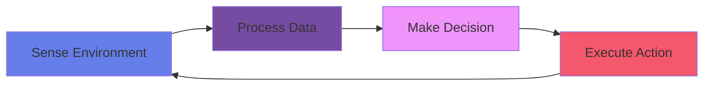

# Physical AI Fundamentals

Physical AI combines **artificial intelligence with robotics** to create intelligent machines that can interact with the physical environment in real-time. This chapter explores the core principles, architectures, and implementations of physical AI systems.


## What Makes AI "Physical"?

The key difference between traditional AI and Physical AI:

| Traditional AI | Physical AI |
|----------------|-------------|
| Virtual environment | Real-world interaction |
| Perfect information | Noisy sensors |
| Unlimited compute time | Real-time constraints |
| No safety concerns | Physical safety critical |
| Digital actions | Physical movements |

:::tip Core Concept
**Physical AI** must handle the "reality gap" - the difference between simulated and real-world performance.
:::

## The Sense-Think-Act Loop

All physical AI systems follow this fundamental cycle:



### Complete Implementation

```python
import time
import random

class PhysicalAISystem:
    """Complete Physical AI system with sense-think-act loop"""

    def __init__(self):
        self.sensors = {
            'distance': DistanceSensor(),
            'temperature': TemperatureSensor(),
            'camera': CameraSensor()
        }
        self.actuators = {
            'motor_left': Motor(pin=1),
            'motor_right': Motor(pin=2),
            'gripper': Gripper(pin=3)
        }
        self.state = 'IDLE'

    def sense(self):
        """Gather sensor data"""
        data = {}
        for name, sensor in self.sensors.items():
            data[name] = sensor.read()
        return data

    def think(self, sensor_data):
        """Process data and make decision"""
        distance = sensor_data['distance']
        temperature = sensor_data['temperature']

        if distance < 20:
            return 'AVOID_OBSTACLE'
        elif temperature > 30:
            return 'COOLING_MODE'
        else:
            return 'NORMAL_OPERATION'

    def act(self, decision):
        """Execute physical actions"""
        if decision == 'AVOID_OBSTACLE':
            self.actuators['motor_left'].set_speed(-50)
            self.actuators['motor_right'].set_speed(50)
            print("🔄 Avoiding obstacle...")

        elif decision == 'COOLING_MODE':
            self.actuators['motor_left'].stop()
            self.actuators['motor_right'].stop()
            print("❄️ Entering cooling mode...")

        else:
            self.actuators['motor_left'].set_speed(100)
            self.actuators['motor_right'].set_speed(100)
            print("➡️ Moving forward...")

    def run(self, duration=10):
        """Main control loop"""
        print("🚀 Starting Physical AI System...\n")
        start_time = time.time()

        while time.time() - start_time < duration:
            # Sense
            sensor_data = self.sense()
            print(f"📊 Sensors: Distance={sensor_data['distance']}cm, "
                  f"Temp={sensor_data['temperature']}°C")

            # Think
            decision = self.think(sensor_data)
            print(f"🧠 Decision: {decision}")

            # Act
            self.act(decision)
            print()

            time.sleep(1)

        print("✅ System shutdown complete")

# Supporting classes
class DistanceSensor:
    def read(self):
        return random.randint(10, 100)

class TemperatureSensor:
    def read(self):
        return random.randint(20, 35)

class CameraSensor:
    def read(self):
        return f"Image_{random.randint(1, 100)}.jpg"

class Motor:
    def __init__(self, pin):
        self.pin = pin
        self.speed = 0

    def set_speed(self, speed):
        self.speed = speed

    def stop(self):
        self.speed = 0

class Gripper:
    def __init__(self, pin):
        self.pin = pin
        self.is_open = True

    def open(self):
        self.is_open = True

    def close(self):
        self.is_open = False

# Run the system
system = PhysicalAISystem()
system.run(duration=10)
```

## Key Components of Physical AI

### 1. 🔍 Sensors (Perception)

Sensors are the "eyes and ears" of physical AI systems.

| Sensor Type | Purpose | Example Use Case |
|-------------|---------|------------------|
| **Vision** | Image/video capture | Object detection, navigation |
| **Distance** | Proximity measurement | Obstacle avoidance |
| **IMU** | Orientation/motion | Balance, movement tracking |
| **Force/Torque** | Physical interaction | Robotic manipulation |
| **Temperature** | Environmental monitoring | Safety systems |

```python
class MultiModalSensorFusion:
    """Combine data from multiple sensors"""

    def __init__(self):
        self.camera = CameraSensor()
        self.lidar = LidarSensor()
        self.imu = IMUSensor()

    def get_fused_data(self):
        """Combine sensor readings for robust perception"""
        vision_data = self.camera.capture()
        distance_map = self.lidar.scan()
        orientation = self.imu.get_orientation()

        return {
            'visual': vision_data,
            'spatial': distance_map,
            'pose': orientation,
            'timestamp': time.time()
        }

    def detect_obstacles(self, fused_data):
        """Use multiple sensors for reliable detection"""
        # Vision-based detection
        vision_obstacles = self.detect_from_vision(fused_data['visual'])

        # LIDAR-based detection
        lidar_obstacles = self.detect_from_lidar(fused_data['spatial'])

        # Fuse results (both must agree)
        confirmed_obstacles = []
        for v_obs in vision_obstacles:
            for l_obs in lidar_obstacles:
                if self.are_same_obstacle(v_obs, l_obs):
                    confirmed_obstacles.append(v_obs)

        return confirmed_obstacles
```

### 2. ⚙️ Actuators (Action)

Actuators convert electrical signals into physical motion.

**Types of Actuators:**

```python
class ActuatorLibrary:
    """Common actuator types and their characteristics"""

    @staticmethod
    def dc_motor():
        """DC Motor - Simple speed control"""
        return {
            'type': 'DC Motor',
            'control': 'PWM (Speed)',
            'precision': 'Low',
            'torque': 'High',
            'use_case': 'Wheels, fans, pumps'
        }

    @staticmethod
    def servo_motor():
        """Servo Motor - Precise position control"""
        return {
            'type': 'Servo Motor',
            'control': 'PWM (Position)',
            'precision': 'High',
            'range': '0-180° (standard)',
            'use_case': 'Robot arms, steering'
        }

    @staticmethod
    def stepper_motor():
        """Stepper Motor - Very precise positioning"""
        return {
            'type': 'Stepper Motor',
            'control': 'Step/Direction pulses',
            'precision': 'Very High',
            'torque': 'High at low speeds',
            'use_case': '3D printers, CNC machines'
        }
```

### 3. 🧠 Controllers (Intelligence)

Controllers bridge sensors and actuators with intelligent decision-making.

```python
class IntelligentController:
    """AI-based controller for physical systems"""

    def __init__(self):
        self.model = self.load_trained_model()
        self.memory = []
        self.learning_rate = 0.01

    def load_trained_model(self):
        """Load pre-trained neural network"""
        # Simplified model representation
        return {
            'layers': [64, 32, 16, 4],
            'weights': 'model_weights.pkl',
            'accuracy': 0.95
        }

    def predict_action(self, sensor_input):
        """Use AI to determine best action"""
        # Normalize inputs
        normalized = self.normalize(sensor_input)

        # Forward pass through network
        prediction = self.model_inference(normalized)

        # Convert to action
        action = self.prediction_to_action(prediction)

        return action

    def learn_from_experience(self, state, action, reward):
        """Online learning from interactions"""
        self.memory.append({
            'state': state,
            'action': action,
            'reward': reward
        })

        if len(self.memory) > 1000:
            self.update_model()

    def update_model(self):
        """Update model weights based on experience"""
        print("🎓 Learning from experience...")
        # Implement gradient descent update
        pass
```

## Hardware Platforms

### Popular Robotics Platforms

| Platform | Best For | Processing Power | Price Range |
|----------|----------|------------------|-------------|
| **Arduino** | Simple control | 16 MHz, 8-bit | $20-50 |
| **Raspberry Pi** | Computer vision, AI | 1.5 GHz, quad-core | $35-75 |
| **NVIDIA Jetson** | Deep learning | GPU-accelerated | $99-499 |
| **ESP32** | IoT, wireless | 240 MHz, dual-core | $5-15 |

:::tip Hardware Selection
Choose hardware based on:
- **Computational needs** (simple control vs. deep learning)
- **Power constraints** (battery vs. wall power)
- **Cost budget** (prototype vs. production)
- **Development ecosystem** (libraries, community)
:::

## Software Frameworks

### ROS (Robot Operating System)

```python
# ROS-style node example
import rospy
from sensor_msgs.msg import LaserScan
from geometry_msgs.msg import Twist

class ObstacleAvoidanceNode:
    """ROS node for obstacle avoidance"""

    def __init__(self):
        rospy.init_node('obstacle_avoider')

        # Subscribe to laser scan
        self.laser_sub = rospy.Subscriber(
            '/scan', LaserScan, self.laser_callback
        )

        # Publish velocity commands
        self.cmd_pub = rospy.Publisher(
            '/cmd_vel', Twist, queue_size=10
        )

        self.safe_distance = 0.5  # meters

    def laser_callback(self, scan):
        """Process laser scan data"""
        # Find minimum distance
        min_dist = min(scan.ranges)

        # Create velocity command
        cmd = Twist()

        if min_dist < self.safe_distance:
            # Obstacle detected - turn
            cmd.linear.x = 0.0
            cmd.angular.z = 0.5
        else:
            # Clear path - move forward
            cmd.linear.x = 0.3
            cmd.angular.z = 0.0

        self.cmd_pub.publish(cmd)

    def run(self):
        """Keep node running"""
        rospy.spin()

# Start the node
if __name__ == '__main__':
    node = ObstacleAvoidanceNode()
    node.run()
```

## Real-World Examples

### 🚗 Self-Driving Cars

**Sensors:** Cameras, LIDAR, RADAR, GPS, IMU
**AI Models:** CNN for vision, Path planning algorithms
**Actuators:** Steering, throttle, brakes

```python
class AutonomousVehicle:
    """Simplified self-driving car system"""

    def __init__(self):
        self.sensors = {
            'camera': CameraSensor(),
            'lidar': LidarSensor(),
            'gps': GPSSensor()
        }
        self.position = (0, 0)
        self.heading = 0
        self.speed = 0

    def perceive_environment(self):
        """Gather and process sensor data"""
        camera_img = self.sensors['camera'].capture()
        lidar_cloud = self.sensors['lidar'].scan()
        gps_pos = self.sensors['gps'].get_position()

        # Detect lanes
        lanes = self.detect_lanes(camera_img)

        # Detect obstacles
        obstacles = self.detect_obstacles(lidar_cloud)

        # Localize
        self.position = gps_pos

        return {
            'lanes': lanes,
            'obstacles': obstacles,
            'position': self.position
        }

    def plan_path(self, perception):
        """Plan safe trajectory"""
        # Simplified path planning
        if perception['obstacles']:
            return 'SLOW_DOWN'
        elif not perception['lanes']:
            return 'STOP'
        else:
            return 'FOLLOW_LANE'

    def control_vehicle(self, plan):
        """Execute driving commands"""
        if plan == 'FOLLOW_LANE':
            self.speed = 50  # km/h
            print("✅ Following lane at 50 km/h")
        elif plan == 'SLOW_DOWN':
            self.speed = max(0, self.speed - 10)
            print("⚠️ Slowing down to avoid obstacle")
        elif plan == 'STOP':
            self.speed = 0
            print("🛑 Stopping - no lane detected")
```

### 🏭 Robotic Arm Assembly

```python
class RoboticArm:
    """6-DOF robotic arm for assembly tasks"""

    def __init__(self):
        self.joints = [ServoMotor(pin=i) for i in range(6)]
        self.gripper = Gripper(pin=6)
        self.camera = CameraSensor()

    def move_to_position(self, x, y, z):
        """Move end-effector to target position"""
        # Inverse kinematics
        joint_angles = self.inverse_kinematics(x, y, z)

        # Move each joint
        for i, angle in enumerate(joint_angles):
            self.joints[i].set_angle(angle)
            time.sleep(0.1)

        print(f"✅ Moved to position ({x}, {y}, {z})")

    def pick_and_place(self, object_type):
        """Complete pick-and-place operation"""
        # 1. Locate object
        object_pos = self.detect_object(object_type)

        # 2. Move above object
        self.move_to_position(object_pos[0], object_pos[1], object_pos[2] + 10)

        # 3. Move down
        self.move_to_position(object_pos[0], object_pos[1], object_pos[2])

        # 4. Grip
        self.gripper.close()
        time.sleep(0.5)

        # 5. Lift
        self.move_to_position(object_pos[0], object_pos[1], object_pos[2] + 10)

        # 6. Move to target
        target_pos = self.get_target_location(object_type)
        self.move_to_position(*target_pos)

        # 7. Release
        self.gripper.open()

        print(f"✅ Completed pick-and-place for {object_type}")
```

## Challenges in Physical AI

:::warning Common Challenges
1. **Sensor Noise** - Real sensors are imperfect
2. **Latency** - Processing delays affect performance
3. **Power Constraints** - Battery life limitations
4. **Safety** - Physical systems can cause harm
5. **Sim-to-Real Gap** - Simulations don't match reality
6. **Environmental Variations** - Weather, lighting, terrain
:::

### Handling Sensor Noise

```python
class NoiseFilter:
    """Filter sensor noise for robust perception"""

    def __init__(self, window_size=5):
        self.window_size = window_size
        self.history = []

    def moving_average(self, new_value):
        """Simple moving average filter"""
        self.history.append(new_value)

        if len(self.history) > self.window_size:
            self.history.pop(0)

        return sum(self.history) / len(self.history)

    def kalman_filter(self, measurement, estimate, uncertainty):
        """Kalman filter for optimal estimation"""
        # Simplified 1D Kalman filter
        kalman_gain = uncertainty / (uncertainty + 1.0)
        estimate = estimate + kalman_gain * (measurement - estimate)
        uncertainty = (1 - kalman_gain) * uncertainty

        return estimate, uncertainty
```

## 🎯 Hands-On Project: Line Following Robot

Build a complete line-following robot:

```python
class LineFollowerRobot:
    """Complete line following robot implementation"""

    def __init__(self):
        self.ir_sensors = [
            IRSensor(pin=i) for i in range(5)
        ]
        self.motor_left = Motor(pin=10)
        self.motor_right = Motor(pin=11)
        self.base_speed = 100

    def read_line_position(self):
        """Determine line position from IR sensors"""
        readings = [s.read() for s in self.ir_sensors]

        # Calculate weighted position
        weights = [-2, -1, 0, 1, 2]
        position = sum(r * w for r, w in zip(readings, weights))
        position /= sum(readings) if sum(readings) > 0 else 1

        return position

    def follow_line(self):
        """PD controller for line following"""
        position = self.read_line_position()

        # PD control
        kp = 50  # Proportional gain
        kd = 20  # Derivative gain

        error = position
        derivative = error - getattr(self, 'prev_error', 0)

        correction = kp * error + kd * derivative

        # Set motor speeds
        left_speed = self.base_speed + correction
        right_speed = self.base_speed - correction

        self.motor_left.set_speed(left_speed)
        self.motor_right.set_speed(right_speed)

        self.prev_error = error

        return position

    def run(self):
        """Main control loop"""
        print("🚀 Line follower started!")

        while True:
            position = self.follow_line()
            print(f"📍 Line position: {position:.2f}")
            time.sleep(0.05)  # 20 Hz update rate
```

:::tip Try It!
Experiment with:
- Different PD gain values
- Adding integral term (PID)
- Varying base speed
- Adding obstacle detection
:::

## What's Next?

In **Chapter 3**, we'll explore **Humanoid Robotics**, including:
- Human-like robot designs
- Bipedal locomotion
- Human-robot interaction
- Advanced manipulation

---

**Continue Learning** → [Chapter 3: Humanoid Robotics →](/docs/chapter3-humanoid-robotics)
