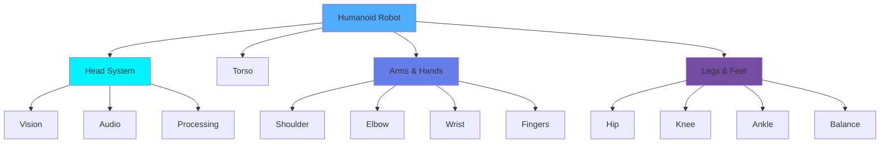

# Humanoid Robotics

Humanoid robots are **sophisticated machines designed to resemble and interact like humans**, featuring bipedal locomotion, dexterous manipulation, and human-like perception. This chapter explores the design, control, and applications of these remarkable systems.


## What is a Humanoid Robot?

A humanoid robot is an autonomous machine with a **human-like body structure**, typically including:



:::tip Key Insight
Humanoid robots are designed to operate in **human-centered environments** - using doors, stairs, and tools built for human proportions.
:::

## Why Humanoid Form?

| Advantage | Description | Example Use Case |
|-----------|-------------|------------------|
| **Environment Compatibility** | Works in human spaces | Navigate buildings with stairs |
| **Tool Usage** | Use human tools | Operate machinery, use phones |
| **Social Acceptance** | More relatable to humans | Healthcare, customer service |
| **Versatility** | Adaptable to various tasks | Manufacturing, assistance |
| **Research Platform** | Study human biomechanics | Prosthetics, rehabilitation |

## Anatomy of a Humanoid Robot

### 1. 🧠 Head and Perception System

The head houses critical sensing and processing components:

```python
class HumanoidHead:
    """Humanoid robot head with multi-modal perception"""

    def __init__(self):
        # Vision system
        self.cameras = {
            'stereo_left': CameraModule(resolution='1080p'),
            'stereo_right': CameraModule(resolution='1080p'),
            'depth': DepthSensor(range_m=10)
        }

        # Audio system
        self.microphones = [
            Microphone(position='left'),
            Microphone(position='right'),
            Microphone(position='front')
        ]

        # Processing
        self.face_recognizer = FaceRecognitionModel()
        self.speech_processor = SpeechToTextEngine()

        # Neck motors for head movement
        self.neck_pan = ServoMotor(range_deg=180)
        self.neck_tilt = ServoMotor(range_deg=90)

    def track_person(self, person_id):
        """Track a person with head movement"""
        # Detect person location
        face_location = self.face_recognizer.locate(person_id)

        if face_location:
            # Calculate required head angles
            pan_angle = self.calculate_pan(face_location)
            tilt_angle = self.calculate_tilt(face_location)

            # Move head to track
            self.neck_pan.set_angle(pan_angle)
            self.neck_tilt.set_angle(tilt_angle)

            print(f"👁️ Tracking person {person_id}")
            return True

        return False

    def listen_and_respond(self):
        """Listen to speech and process"""
        print("👂 Listening...")

        # Capture audio from all microphones
        audio_data = [mic.record(duration=3) for mic in self.microphones]

        # Process speech (use best channel)
        text = self.speech_processor.transcribe(audio_data[0])

        print(f"🗣️ Heard: '{text}'")
        return text

    def calculate_pan(self, face_location):
        """Calculate horizontal angle to face"""
        # Simplified calculation
        x_offset = face_location['x'] - 640  # Assuming 1280px width
        pan_angle = 90 + (x_offset / 640) * 60
        return max(30, min(150, pan_angle))

    def calculate_tilt(self, face_location):
        """Calculate vertical angle to face"""
        y_offset = face_location['y'] - 360  # Assuming 720px height
        tilt_angle = 45 - (y_offset / 360) * 30
        return max(15, min(75, tilt_angle))
```

### 2. 🦾 Arms and Hands

Humanoid arms enable complex manipulation tasks:

```python
class HumanoidArm:
    """6-DOF humanoid robot arm with gripper"""

    def __init__(self, side='right'):
        self.side = side

        # Arm joints (degrees of freedom)
        self.joints = {
            'shoulder_pitch': ServoMotor(range_deg=180, max_torque=50),
            'shoulder_roll': ServoMotor(range_deg=180, max_torque=50),
            'shoulder_yaw': ServoMotor(range_deg=180, max_torque=30),
            'elbow_pitch': ServoMotor(range_deg=135, max_torque=30),
            'wrist_pitch': ServoMotor(range_deg=180, max_torque=10),
            'wrist_roll': ServoMotor(range_deg=180, max_torque=10)
        }

        # End effector
        self.hand = RoboticHand(fingers=5)

        # Force sensors
        self.force_sensor = ForceSensor(max_force_n=100)

    def reach_position(self, x, y, z):
        """Reach a 3D position using inverse kinematics"""
        print(f"🦾 {self.side.capitalize()} arm reaching ({x}, {y}, {z})")

        # Calculate joint angles using inverse kinematics
        joint_angles = self.inverse_kinematics(x, y, z)

        # Move each joint smoothly
        for joint_name, angle in joint_angles.items():
            self.joints[joint_name].set_angle(angle, speed=50)
            time.sleep(0.05)  # Smooth motion

        print(f"✅ Position reached")
        return True

    def inverse_kinematics(self, x, y, z):
        """Solve inverse kinematics (simplified)"""
        # This is a simplified version - real IK is much more complex
        import math

        # Arm segment lengths (cm)
        L1 = 30  # Upper arm
        L2 = 30  # Forearm

        # Distance to target
        distance = math.sqrt(x**2 + y**2 + z**2)

        # Check if reachable
        if distance > (L1 + L2):
            print("⚠️ Target out of reach!")
            distance = L1 + L2 - 1

        # Calculate angles (simplified 2D solution)
        theta2 = math.acos((distance**2 - L1**2 - L2**2) / (2 * L1 * L2))
        theta1 = math.atan2(z, math.sqrt(x**2 + y**2)) - \
                 math.atan2(L2 * math.sin(theta2), L1 + L2 * math.cos(theta2))

        return {
            'shoulder_pitch': math.degrees(theta1),
            'shoulder_roll': math.degrees(math.atan2(y, x)),
            'shoulder_yaw': 0,
            'elbow_pitch': math.degrees(theta2),
            'wrist_pitch': 0,
            'wrist_roll': 0
        }

    def grasp_object(self, object_name, force_limit=50):
        """Grasp an object with force control"""
        print(f"🤏 Grasping {object_name}...")

        # Close hand until force threshold
        self.hand.close(speed=30)

        # Monitor force
        while self.hand.is_closing():
            force = self.force_sensor.read()

            if force >= force_limit:
                self.hand.stop()
                print(f"✅ Grasped with {force}N force")
                return True

            time.sleep(0.01)

        return False
```

### 3. 🦿 Bipedal Locomotion System

Walking on two legs is one of the most challenging aspects:

```python
class BipedalLocomotion:
    """Humanoid robot walking control system"""

    def __init__(self):
        # Leg joints (6 DOF per leg)
        self.left_leg = {
            'hip_pitch': ServoMotor(range_deg=120),
            'hip_roll': ServoMotor(range_deg=45),
            'hip_yaw': ServoMotor(range_deg=90),
            'knee_pitch': ServoMotor(range_deg=135),
            'ankle_pitch': ServoMotor(range_deg=90),
            'ankle_roll': ServoMotor(range_deg=45)
        }

        self.right_leg = {
            'hip_pitch': ServoMotor(range_deg=120),
            'hip_roll': ServoMotor(range_deg=45),
            'hip_yaw': ServoMotor(range_deg=90),
            'knee_pitch': ServoMotor(range_deg=135),
            'ankle_pitch': ServoMotor(range_deg=90),
            'ankle_roll': ServoMotor(range_deg=45)
        }

        # Balance sensors
        self.imu = IMUSensor()  # Inertial Measurement Unit
        self.foot_pressure = {
            'left': PressureSensor(),
            'right': PressureSensor()
        }

        # Walking parameters
        self.step_length = 15  # cm
        self.step_height = 5   # cm
        self.step_time = 1.0   # seconds

    def walk_forward(self, steps=5):
        """Execute forward walking gait"""
        print(f"🚶 Walking {steps} steps forward...")

        for step in range(steps):
            print(f"  Step {step + 1}/{steps}")

            # Right leg swing phase
            self.swing_phase('right')

            # Left leg swing phase
            self.swing_phase('left')

            # Balance correction
            self.maintain_balance()

        print("✅ Walking complete")

    def swing_phase(self, leg):
        """Execute swing phase for one leg"""
        legs = self.right_leg if leg == 'right' else self.left_leg

        # Lift leg
        legs['hip_pitch'].set_angle(30, speed=100)
        legs['knee_pitch'].set_angle(60, speed=100)
        time.sleep(self.step_time / 4)

        # Swing forward
        legs['hip_pitch'].set_angle(-10, speed=100)
        time.sleep(self.step_time / 4)

        # Lower leg
        legs['knee_pitch'].set_angle(5, speed=100)
        legs['ankle_pitch'].set_angle(0, speed=100)
        time.sleep(self.step_time / 4)

        # Plant foot
        print(f"  {'→' if leg == 'right' else '←'} {leg.capitalize()} foot planted")

    def maintain_balance(self):
        """Active balance control using IMU feedback"""
        # Read orientation
        orientation = self.imu.get_orientation()
        roll = orientation['roll']
        pitch = orientation['pitch']

        # Correct lean using ankle strategy
        if abs(roll) > 2:  # degrees
            correction = roll * 0.5
            self.left_leg['ankle_roll'].adjust(-correction)
            self.right_leg['ankle_roll'].adjust(-correction)

        if abs(pitch) > 2:  # degrees
            correction = pitch * 0.5
            self.left_leg['ankle_pitch'].adjust(-correction)
            self.right_leg['ankle_pitch'].adjust(-correction)

    def zero_moment_point(self):
        """Calculate Zero Moment Point for stability"""
        # Read foot pressure sensors
        left_pressure = self.foot_pressure['left'].read()
        right_pressure = self.foot_pressure['right'].read()

        # Calculate ZMP position
        total_pressure = left_pressure + right_pressure

        if total_pressure > 0:
            zmp_x = (right_pressure * 20 - left_pressure * 20) / total_pressure
            return zmp_x

        return 0
```

## Complete Humanoid Robot System

Here's a full integration:

```python
import time
import math

class HumanoidRobot:
    """Complete humanoid robot with all subsystems"""

    def __init__(self, name="Humanoid-01"):
        self.name = name

        # Initialize subsystems
        self.head = HumanoidHead()
        self.left_arm = HumanoidArm(side='left')
        self.right_arm = HumanoidArm(side='right')
        self.locomotion = BipedalLocomotion()

        # Central processing
        self.ai_controller = AIController()

        # State
        self.position = {'x': 0, 'y': 0, 'theta': 0}
        self.is_active = False

    def initialize(self):
        """Initialize all systems"""
        print(f"🤖 Initializing {self.name}...")

        # Home position for all joints
        print("  Setting home position...")
        self.set_home_position()

        # Calibrate sensors
        print("  Calibrating sensors...")
        self.calibrate_sensors()

        self.is_active = True
        print(f"✅ {self.name} ready!")

    def set_home_position(self):
        """Move to neutral standing position"""
        # Arms at sides
        self.left_arm.reach_position(0, -30, 0)
        self.right_arm.reach_position(0, 30, 0)

        # Standing straight
        for leg in [self.locomotion.left_leg, self.locomotion.right_leg]:
            for joint in leg.values():
                joint.set_angle(0)

    def calibrate_sensors(self):
        """Calibrate all sensors"""
        self.head.cameras['stereo_left'].calibrate()
        self.head.cameras['stereo_right'].calibrate()
        self.locomotion.imu.calibrate()

    def greet_person(self, person_name):
        """Greet a person with wave and speech"""
        print(f"\n👋 Greeting {person_name}...")

        # Track person with head
        self.head.track_person(person_name)
        time.sleep(0.5)

        # Wave with right hand
        print("  Waving hand...")
        for _ in range(3):
            self.right_arm.reach_position(20, 40, 60)
            time.sleep(0.3)
            self.right_arm.reach_position(20, 40, 50)
            time.sleep(0.3)

        # Return to home
        self.right_arm.reach_position(0, 30, 0)

        print(f"🗣️ Hello, {person_name}! Nice to meet you!")

    def pick_and_place_task(self, object_location, target_location):
        """Complete pick-and-place task"""
        print(f"\n📦 Pick and place task started...")

        # Walk to object
        print("  Walking to object...")
        steps_needed = int(object_location['x'] / 15)  # 15cm per step
        self.locomotion.walk_forward(steps=steps_needed)

        # Reach and grasp
        print("  Reaching for object...")
        self.right_arm.reach_position(
            object_location['x'],
            object_location['y'],
            object_location['z']
        )

        self.right_arm.grasp_object("box", force_limit=30)

        # Lift
        print("  Lifting object...")
        self.right_arm.reach_position(
            object_location['x'],
            object_location['y'],
            object_location['z'] + 20
        )

        # Walk to target
        print("  Walking to target...")
        steps_needed = int((target_location['x'] - object_location['x']) / 15)
        if steps_needed > 0:
            self.locomotion.walk_forward(steps=steps_needed)

        # Place
        print("  Placing object...")
        self.right_arm.reach_position(
            target_location['x'],
            target_location['y'],
            target_location['z']
        )

        self.right_arm.hand.open()

        print("✅ Pick and place complete!")

# Demo usage
if __name__ == "__main__":
    # Create humanoid robot
    robot = HumanoidRobot(name="Atlas-Mini")
    robot.initialize()

    # Greet someone
    robot.greet_person("Alice")

    # Perform task
    robot.pick_and_place_task(
        object_location={'x': 30, 'y': 20, 'z': 15},
        target_location={'x': 60, 'y': -20, 'z': 25}
    )
```

## Balance and Stability Control

Maintaining balance is critical for bipedal robots:

### Zero Moment Point (ZMP) Control

```python
class ZMPBalanceController:
    """Advanced balance control using ZMP"""

    def __init__(self):
        self.foot_sensors = {
            'left': [PressureSensor() for _ in range(4)],  # 4 corners
            'right': [PressureSensor() for _ in range(4)]
        }

        self.support_polygon = []
        self.zmp_position = (0, 0)

    def calculate_zmp(self):
        """Calculate current Zero Moment Point"""
        total_force = 0
        moment_x = 0
        moment_y = 0

        # Left foot contributions
        for i, sensor in enumerate(self.foot_sensors['left']):
            force = sensor.read()
            position = self.get_sensor_position('left', i)

            total_force += force
            moment_x += force * position[0]
            moment_y += force * position[1]

        # Right foot contributions
        for i, sensor in enumerate(self.foot_sensors['right']):
            force = sensor.read()
            position = self.get_sensor_position('right', i)

            total_force += force
            moment_x += force * position[0]
            moment_y += force * position[1]

        if total_force > 0:
            zmp_x = moment_x / total_force
            zmp_y = moment_y / total_force
            self.zmp_position = (zmp_x, zmp_y)

        return self.zmp_position

    def is_stable(self):
        """Check if ZMP is within support polygon"""
        zmp = self.calculate_zmp()

        # Check if ZMP is inside support polygon
        return self.point_in_polygon(zmp, self.support_polygon)

    def get_sensor_position(self, foot, sensor_id):
        """Get 3D position of pressure sensor"""
        # Simplified sensor positions
        foot_offset = -10 if foot == 'left' else 10
        sensor_positions = [
            (5, foot_offset), (5, foot_offset + 8),
            (-5, foot_offset), (-5, foot_offset + 8)
        ]
        return sensor_positions[sensor_id]

    def point_in_polygon(self, point, polygon):
        """Check if point is inside polygon"""
        # Simplified implementation
        return True  # Placeholder
```

## Real-World Humanoid Robots

### Famous Examples

| Robot | Developer | Key Features | Year |
|-------|-----------|--------------|------|
| **ASIMO** | Honda | 57cm tall, 130 DOF, running capability | 2000 |
| **Atlas** | Boston Dynamics | Backflips, parkour, 28 DOF | 2013 |
| **Pepper** | SoftBank | Social interaction, emotion recognition | 2014 |
| **Sophia** | Hanson Robotics | AI conversation, facial expressions | 2016 |
| **Optimus** | Tesla | General-purpose work robot | 2022 |

### Applications in Industry

```python
class IndustrialHumanoid:
    """Humanoid robot for manufacturing tasks"""

    def __init__(self):
        self.capabilities = [
            'assembly',
            'quality_inspection',
            'material_handling',
            'machine_operation'
        ]

        self.current_task = None

    def perform_assembly(self, part_a, part_b):
        """Assemble two parts together"""
        print("🔧 Assembly task started...")

        # Pick up first part
        print(f"  Picking up {part_a}")
        self.grasp_part(part_a)

        # Pick up second part with other hand
        print(f"  Picking up {part_b}")
        self.grasp_part(part_b, hand='left')

        # Align parts
        print("  Aligning parts...")
        self.align_parts(part_a, part_b)

        # Apply force to join
        print("  Joining parts...")
        self.apply_force(direction='z', force_n=50)

        # Verify assembly
        if self.verify_assembly():
            print("✅ Assembly successful!")
            return True
        else:
            print("❌ Assembly failed - retrying...")
            return False
```

## Challenges in Humanoid Robotics

:::warning Technical Challenges
1. **Balance Control** - Maintaining stability during dynamic movements
2. **Energy Efficiency** - Bipedal walking consumes significant power
3. **Dexterity** - Achieving human-level hand manipulation
4. **Real-time Control** - Processing sensor data fast enough
5. **Safety** - Ensuring safe human-robot interaction
6. **Cost** - High-precision actuators and sensors are expensive
:::

## 🎯 Hands-On Project: Simple Humanoid Simulator

Build a basic humanoid simulation:

```python
class SimpleHumanoidSim:
    """Simple 2D humanoid robot simulator"""

    def __init__(self):
        # Joint angles (degrees)
        self.joints = {
            'left_shoulder': 0,
            'left_elbow': 0,
            'right_shoulder': 0,
            'right_elbow': 0,
            'left_hip': 0,
            'left_knee': 0,
            'right_hip': 0,
            'right_knee': 0
        }

        # Segment lengths (arbitrary units)
        self.segments = {
            'upper_arm': 10,
            'forearm': 10,
            'thigh': 15,
            'shin': 15
        }

        self.position = (0, 0)

    def set_pose(self, pose_name):
        """Set predefined pose"""
        poses = {
            'stand': {
                'left_shoulder': 0, 'left_elbow': 0,
                'right_shoulder': 0, 'right_elbow': 0,
                'left_hip': 0, 'left_knee': 0,
                'right_hip': 0, 'right_knee': 0
            },
            'wave': {
                'left_shoulder': 0, 'left_elbow': 0,
                'right_shoulder': 90, 'right_elbow': -45,
                'left_hip': 0, 'left_knee': 0,
                'right_hip': 0, 'right_knee': 0
            },
            'walk_left': {
                'left_shoulder': -20, 'left_elbow': 0,
                'right_shoulder': 20, 'right_elbow': 0,
                'left_hip': 30, 'left_knee': 60,
                'right_hip': -10, 'right_knee': 5
            }
        }

        if pose_name in poses:
            self.joints = poses[pose_name].copy()
            print(f"🤸 Pose set to: {pose_name}")
            self.display()

    def display(self):
        """Display current robot state"""
        print("\n" + "="*40)
        print(f"Position: {self.position}")
        print("Joints:")
        for joint, angle in self.joints.items():
            bar = "█" * int(abs(angle) / 10)
            print(f"  {joint:15s}: {angle:6.1f}° {bar}")
        print("="*40 + "\n")

    def animate_wave(self):
        """Animate waving motion"""
        print("👋 Animating wave gesture...")

        for i in range(5):
            # Wave up
            self.joints['right_shoulder'] = 90 + math.sin(i) * 20
            self.joints['right_elbow'] = -45 + math.sin(i * 2) * 30
            print(f"  Frame {i*2 + 1}")
            time.sleep(0.2)

            # Wave down
            self.joints['right_shoulder'] = 90 - math.sin(i) * 20
            self.joints['right_elbow'] = -45 - math.sin(i * 2) * 30
            print(f"  Frame {i*2 + 2}")
            time.sleep(0.2)

        print("✅ Wave complete!")

# Run simulation
sim = SimpleHumanoidSim()
sim.set_pose('stand')
sim.set_pose('wave')
sim.animate_wave()
```

:::tip Experiment!
Try modifying the simulator to:
- Add more joint angles
- Create new poses
- Implement walking animation
- Add collision detection
:::

## Future of Humanoid Robotics

### Emerging Trends

- **AI Integration**: ChatGPT-like language models for natural interaction
- **Soft Robotics**: Compliant materials for safer human interaction
- **Biomimetic Design**: Learning from human biomechanics
- **Cloud Robotics**: Distributed intelligence and learning
- **Swarm Humanoids**: Multiple robots working together

## What's Next?

In **Chapter 4**, we'll explore **Sensors and Actuators** in depth:
- Vision systems and cameras
- Force and tactile sensors
- Motor types and control
- Sensor fusion techniques

---

**Continue Learning** → [Chapter 4: Sensors & Actuators →](/docs/chapter4-sensors-actuators)
