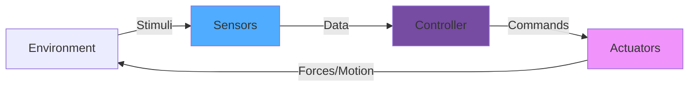

# Sensors & Actuators

Sensors and actuators are the **interface between robots and the physical world**. Sensors provide perception, while actuators enable action. This chapter explores the complete spectrum of sensing and actuation technologies used in robotics.


## The Perception-Action Loop



:::tip Core Principle
**Sensors** convert physical phenomena into electrical signals.
**Actuators** convert electrical signals into physical motion.
:::

---

# Part 1: Sensors

## Types of Sensors

| Sensor Category | Measures | Common Types | Applications |
|----------------|----------|--------------|--------------|
| **Position** | Location, orientation | GPS, Encoders, IMU | Navigation, odometry |
| **Proximity** | Distance to objects | Ultrasonic, IR, LIDAR | Obstacle avoidance |
| **Vision** | Images, depth | Cameras, stereo, ToF | Object detection, mapping |
| **Force/Tactile** | Pressure, touch | Force sensors, tactile arrays | Grasping, manipulation |
| **Environmental** | Temperature, humidity | Thermometers, hygrometers | Climate control |

## 1. 📏 Distance & Proximity Sensors

### Ultrasonic Sensors

**Principle:** Time-of-flight measurement using sound waves (40 kHz)

```python
import time

class UltrasonicSensor:
    """HC-SR04 Ultrasonic distance sensor"""

    def __init__(self, trigger_pin, echo_pin):
        self.trigger_pin = trigger_pin
        self.echo_pin = echo_pin
        self.sound_speed = 343  # m/s at 20°C

    def measure_distance(self):
        """Measure distance in centimeters"""
        # Send trigger pulse
        self.trigger_pulse()

        # Measure echo time
        pulse_duration = self.measure_echo()

        # Calculate distance (time * speed / 2)
        distance_cm = (pulse_duration * self.sound_speed * 100) / 2

        return distance_cm

    def trigger_pulse(self):
        """Send 10µs trigger pulse"""
        # GPIO operations would go here
        print("Sending trigger pulse...")
        time.sleep(0.00001)  # 10 microseconds

    def measure_echo(self):
        """Measure echo pulse duration"""
        # Simplified - would use GPIO timing
        start_time = time.time()
        time.sleep(0.0001)  # Simulated echo time
        end_time = time.time()

        return end_time - start_time

    def get_multiple_readings(self, count=5):
        """Get median of multiple readings for accuracy"""
        readings = []

        for _ in range(count):
            distance = self.measure_distance()
            readings.append(distance)
            time.sleep(0.06)  # 60ms between readings

        # Return median value
        readings.sort()
        return readings[len(readings) // 2]

# Usage example
sensor = UltrasonicSensor(trigger_pin=23, echo_pin=24)
distance = sensor.get_multiple_readings()
print(f"Distance: {distance:.1f} cm")
```

### Infrared (IR) Sensors

```python
class IRProximitySensor:
    """Sharp GP2Y0A21 IR distance sensor"""

    def __init__(self, analog_pin):
        self.analog_pin = analog_pin

        # Calibration curve (voltage to distance)
        self.calibration = {
            3.0: 10,   # 3.0V = 10cm
            2.0: 15,
            1.4: 20,
            1.0: 30,
            0.6: 50,
            0.4: 80
        }

    def read_voltage(self):
        """Read analog voltage (0-5V)"""
        # ADC reading would go here
        import random
        return random.uniform(0.4, 3.0)

    def voltage_to_distance(self, voltage):
        """Convert voltage to distance using calibration"""
        # Linear interpolation
        voltages = sorted(self.calibration.keys(), reverse=True)

        for i in range(len(voltages) - 1):
            v_high = voltages[i]
            v_low = voltages[i + 1]

            if v_low <= voltage <= v_high:
                d_high = self.calibration[v_high]
                d_low = self.calibration[v_low]

                # Interpolate
                ratio = (voltage - v_low) / (v_high - v_low)
                distance = d_low + ratio * (d_high - d_low)

                return distance

        return None

    def measure(self):
        """Measure distance in cm"""
        voltage = self.read_voltage()
        distance = self.voltage_to_distance(voltage)

        print(f"📡 Voltage: {voltage:.2f}V → Distance: {distance:.1f}cm")
        return distance
```

### LIDAR Sensors

**Principle:** Laser time-of-flight with rotating mirror for 360° scanning

```python
import math
import numpy as np

class LIDARSensor:
    """2D LIDAR scanner"""

    def __init__(self, angular_resolution=1.0):
        self.angular_resolution = angular_resolution  # degrees
        self.max_range = 1000  # cm
        self.scan_data = []

    def perform_scan(self):
        """Perform full 360° scan"""
        print("🔄 Starting LIDAR scan...")

        angles = np.arange(0, 360, self.angular_resolution)
        self.scan_data = []

        for angle in angles:
            distance = self.measure_at_angle(angle)
            self.scan_data.append({
                'angle': angle,
                'distance': distance
            })

        print(f"✅ Scan complete: {len(self.scan_data)} points")
        return self.scan_data

    def measure_at_angle(self, angle):
        """Measure distance at specific angle"""
        # Simulated measurement
        import random
        return random.randint(50, self.max_range)

    def get_point_cloud(self):
        """Convert scan to (x, y) point cloud"""
        points = []

        for reading in self.scan_data:
            angle_rad = math.radians(reading['angle'])
            distance = reading['distance']

            x = distance * math.cos(angle_rad)
            y = distance * math.sin(angle_rad)

            points.append((x, y))

        return points

    def detect_obstacles(self, min_distance=50):
        """Find obstacles within minimum distance"""
        obstacles = []

        for reading in self.scan_data:
            if reading['distance'] < min_distance:
                obstacles.append(reading)

        print(f"⚠️ Found {len(obstacles)} obstacles within {min_distance}cm")
        return obstacles

# Usage
lidar = LIDARSensor(angular_resolution=0.5)
scan = lidar.perform_scan()
obstacles = lidar.detect_obstacles(min_distance=100)
point_cloud = lidar.get_point_cloud()
```

## 2. 📷 Vision Sensors

### Camera Basics

```python
class CameraModule:
    """Digital camera interface"""

    def __init__(self, resolution=(1920, 1080), fps=30):
        self.resolution = resolution
        self.fps = fps
        self.is_capturing = False

    def capture_frame(self):
        """Capture single image frame"""
        print(f"📸 Capturing {self.resolution[0]}x{self.resolution[1]} frame")

        # Image capture would happen here
        frame = {
            'width': self.resolution[0],
            'height': self.resolution[1],
            'channels': 3,  # RGB
            'timestamp': time.time()
        }

        return frame

    def start_stream(self):
        """Start continuous video capture"""
        self.is_capturing = True
        print(f"🎥 Starting video stream at {self.fps} FPS")

    def stop_stream(self):
        """Stop video capture"""
        self.is_capturing = False
        print("⏹️ Video stream stopped")

    def apply_processing(self, frame, operations):
        """Apply image processing operations"""
        processed = frame.copy()

        for op in operations:
            if op == 'grayscale':
                print("  Converting to grayscale...")
            elif op == 'blur':
                print("  Applying blur filter...")
            elif op == 'edge_detection':
                print("  Detecting edges...")

        return processed

# Example usage
camera = CameraModule(resolution=(1280, 720), fps=60)
frame = camera.capture_frame()
processed = camera.apply_processing(frame, ['grayscale', 'edge_detection'])
```

### Depth Cameras (ToF / Stereo)

```python
class DepthCamera:
    """Time-of-Flight depth camera"""

    def __init__(self, resolution=(640, 480)):
        self.resolution = resolution
        self.max_depth = 500  # cm

    def capture_depth_map(self):
        """Capture depth image"""
        print(f"📊 Capturing depth map {self.resolution[0]}x{self.resolution[1]}")

        # Simulated depth data
        import numpy as np
        depth_map = np.random.randint(
            10, self.max_depth,
            size=self.resolution
        )

        return depth_map

    def get_depth_at_pixel(self, x, y):
        """Get depth value at specific pixel"""
        depth_map = self.capture_depth_map()
        depth = depth_map[y, x]

        print(f"Depth at ({x}, {y}): {depth} cm")
        return depth

    def segment_by_depth(self, depth_map, threshold):
        """Segment image by depth threshold"""
        import numpy as np

        near_objects = depth_map < threshold
        far_objects = depth_map >= threshold

        print(f"Near objects: {np.sum(near_objects)} pixels")
        print(f"Far objects: {np.sum(far_objects)} pixels")

        return near_objects, far_objects
```

## 3. 🧭 Inertial Measurement Unit (IMU)

**Components:** Accelerometer + Gyroscope + (optional) Magnetometer

```python
import math
import numpy as np

class IMUSensor:
    """9-DOF Inertial Measurement Unit"""

    def __init__(self):
        # Sensor ranges
        self.accel_range = 16  # ±16g
        self.gyro_range = 2000  # ±2000°/s
        self.mag_range = 4800  # ±4800µT

        # State
        self.orientation = {'roll': 0, 'pitch': 0, 'yaw': 0}
        self.velocity = {'x': 0, 'y': 0, 'z': 0}
        self.position = {'x': 0, 'y': 0, 'z': 0}

    def read_accelerometer(self):
        """Read 3-axis acceleration (g)"""
        import random
        return {
            'x': random.uniform(-1, 1),
            'y': random.uniform(-1, 1),
            'z': random.uniform(0.9, 1.1)  # Gravity
        }

    def read_gyroscope(self):
        """Read 3-axis angular velocity (°/s)"""
        import random
        return {
            'x': random.uniform(-10, 10),
            'y': random.uniform(-10, 10),
            'z': random.uniform(-10, 10)
        }

    def read_magnetometer(self):
        """Read 3-axis magnetic field (µT)"""
        import random
        return {
            'x': random.uniform(-100, 100),
            'y': random.uniform(-100, 100),
            'z': random.uniform(-100, 100)
        }

    def calculate_orientation(self):
        """Calculate roll, pitch, yaw from sensors"""
        accel = self.read_accelerometer()

        # Calculate roll and pitch from accelerometer
        roll = math.atan2(accel['y'], accel['z'])
        pitch = math.atan2(-accel['x'],
                          math.sqrt(accel['y']**2 + accel['z']**2))

        # Convert to degrees
        self.orientation['roll'] = math.degrees(roll)
        self.orientation['pitch'] = math.degrees(pitch)

        print(f"📐 Orientation: Roll={self.orientation['roll']:.1f}°, "
              f"Pitch={self.orientation['pitch']:.1f}°")

        return self.orientation

    def detect_motion(self, accel_threshold=0.2):
        """Detect if device is moving"""
        accel = self.read_accelerometer()

        # Calculate total acceleration (minus gravity)
        total_accel = math.sqrt(
            accel['x']**2 +
            accel['y']**2 +
            (accel['z'] - 1)**2
        )

        is_moving = total_accel > accel_threshold

        if is_moving:
            print("🏃 Motion detected!")
        else:
            print("🧍 Stationary")

        return is_moving

    def calibrate(self):
        """Calibrate sensors"""
        print("🔧 Calibrating IMU...")
        print("  Keep sensor stationary...")

        # Take multiple readings to find offset
        samples = 100
        accel_sum = {'x': 0, 'y': 0, 'z': 0}

        for _ in range(samples):
            accel = self.read_accelerometer()
            accel_sum['x'] += accel['x']
            accel_sum['y'] += accel['y']
            accel_sum['z'] += accel['z']

        # Calculate offset
        self.accel_offset = {
            'x': accel_sum['x'] / samples,
            'y': accel_sum['y'] / samples,
            'z': (accel_sum['z'] / samples) - 1  # Remove gravity
        }

        print("✅ Calibration complete")
```

## 4. ⚡ Force & Tactile Sensors

### Force Sensor

```python
class ForceSensor:
    """Load cell force sensor"""

    def __init__(self, max_force=100):
        self.max_force = max_force  # Newtons
        self.calibration_factor = 1.0
        self.zero_offset = 0

    def read_raw(self):
        """Read raw sensor value"""
        import random
        return random.uniform(0, 1023)  # 10-bit ADC

    def read_force(self):
        """Read force in Newtons"""
        raw = self.read_raw()

        # Convert to force
        force = (raw - self.zero_offset) * self.calibration_factor
        force = max(0, min(self.max_force, force))

        return force

    def tare(self):
        """Zero the sensor"""
        print("⚖️ Taring sensor...")
        samples = 10
        total = sum(self.read_raw() for _ in range(samples))
        self.zero_offset = total / samples
        print(f"✅ Zero offset: {self.zero_offset:.2f}")

    def wait_for_contact(self, threshold=1.0):
        """Wait until force detected"""
        print(f"⏳ Waiting for contact (>{threshold}N)...")

        while True:
            force = self.read_force()

            if force > threshold:
                print(f"✅ Contact detected: {force:.2f}N")
                return True

            time.sleep(0.1)

# Usage
force_sensor = ForceSensor(max_force=50)
force_sensor.tare()
force_sensor.wait_for_contact(threshold=2.0)
```

### Tactile Sensor Array

```python
class TactileSensorArray:
    """Pressure-sensitive tactile array"""

    def __init__(self, rows=4, cols=4):
        self.rows = rows
        self.cols = cols
        self.sensitivity = 1.0

    def read_array(self):
        """Read entire tactile array"""
        import numpy as np

        # Simulated pressure readings
        pressures = np.random.rand(self.rows, self.cols) * 100

        return pressures

    def visualize_touch(self, pressures):
        """Display tactile pressure as ASCII art"""
        print("\n📱 Tactile Sensor Array:")
        print("┌" + "─" * (self.cols * 4 - 1) + "┐")

        for row in pressures:
            print("│", end="")
            for pressure in row:
                if pressure > 75:
                    symbol = "███"
                elif pressure > 50:
                    symbol = "▓▓▓"
                elif pressure > 25:
                    symbol = "▒▒▒"
                else:
                    symbol = "░░░"
                print(symbol, end=" ")
            print("│")

        print("└" + "─" * (self.cols * 4 - 1) + "┘\n")

    def find_contact_center(self, pressures, threshold=50):
        """Find center of contact pressure"""
        import numpy as np

        # Find cells above threshold
        contacts = pressures > threshold

        if not np.any(contacts):
            return None

        # Calculate centroid
        rows, cols = np.where(contacts)
        center_row = np.mean(rows)
        center_col = np.mean(cols)

        print(f"📍 Contact center: ({center_row:.1f}, {center_col:.1f})")
        return (center_row, center_col)

# Demo
tactile = TactileSensorArray(rows=6, cols=6)
pressures = tactile.read_array()
tactile.visualize_touch(pressures)
center = tactile.find_contact_center(pressures)
```

---

# Part 2: Actuators

## Types of Actuators

| Actuator Type | Motion | Control | Typical Use |
|--------------|--------|---------|-------------|
| **DC Motor** | Continuous rotation | Speed (PWM) | Wheels, fans |
| **Servo Motor** | Precise angles (0-180°) | Position | Robot joints |
| **Stepper Motor** | Discrete steps | Step/direction | 3D printers |
| **Linear Actuator** | Linear motion | Position/force | Lifting, pushing |
| **Pneumatic** | High force | Pressure | Grippers, cylinders |

## 1. ⚙️ DC Motors

```python
class DCMotor:
    """Brushed DC motor with PWM control"""

    def __init__(self, pwm_pin, dir_pin1, dir_pin2):
        self.pwm_pin = pwm_pin
        self.dir_pin1 = dir_pin1
        self.dir_pin2 = dir_pin2

        self.speed = 0  # -100 to 100
        self.current_rpm = 0

    def set_speed(self, speed):
        """Set motor speed (-100 to 100)"""
        self.speed = max(-100, min(100, speed))

        if self.speed > 0:
            direction = "FORWARD"
            pwm_duty = abs(self.speed)
        elif self.speed < 0:
            direction = "REVERSE"
            pwm_duty = abs(self.speed)
        else:
            direction = "STOP"
            pwm_duty = 0

        print(f"⚙️ Motor: {direction} at {pwm_duty}% PWM")

        # Set GPIO pins (simplified)
        self.apply_pwm(pwm_duty)

    def apply_pwm(self, duty_cycle):
        """Apply PWM signal"""
        # PWM control would go here
        self.current_rpm = duty_cycle * 2  # Simplified conversion

    def brake(self):
        """Active braking"""
        print("🛑 Motor braking...")
        self.speed = 0
        self.apply_pwm(0)

    def coast(self):
        """Let motor coast to stop"""
        print("🌊 Motor coasting...")
        self.apply_pwm(0)

# Usage
motor = DCMotor(pwm_pin=12, dir_pin1=16, dir_pin2=18)
motor.set_speed(75)    # 75% forward
time.sleep(2)
motor.set_speed(-50)   # 50% reverse
time.sleep(2)
motor.brake()
```

## 2. 🎯 Servo Motors

```python
class ServoMotor:
    """Standard hobby servo motor (0-180°)"""

    def __init__(self, pin, min_pulse=1000, max_pulse=2000):
        self.pin = pin
        self.min_pulse = min_pulse  # microseconds
        self.max_pulse = max_pulse
        self.current_angle = 90

    def set_angle(self, angle, speed=None):
        """Move to specific angle"""
        # Constrain angle
        angle = max(0, min(180, angle))

        # Calculate pulse width
        pulse_width = self.angle_to_pulse(angle)

        print(f"🎯 Servo moving to {angle}° (pulse: {pulse_width}µs)")

        if speed:
            # Gradual movement
            self.move_gradual(angle, speed)
        else:
            # Instant movement
            self.current_angle = angle

    def angle_to_pulse(self, angle):
        """Convert angle to pulse width"""
        pulse_range = self.max_pulse - self.min_pulse
        pulse = self.min_pulse + (angle / 180.0) * pulse_range
        return int(pulse)

    def move_gradual(self, target_angle, speed):
        """Move gradually to target"""
        step = 1 if target_angle > self.current_angle else -1

        while self.current_angle != target_angle:
            self.current_angle += step
            time.sleep(1.0 / speed)  # Speed in steps/second

    def sweep(self, start=0, end=180, step=5, delay=0.05):
        """Sweep between two angles"""
        print(f"🔄 Sweeping from {start}° to {end}°")

        for angle in range(start, end + 1, step):
            self.set_angle(angle)
            time.sleep(delay)

# Usage
servo = ServoMotor(pin=11)
servo.set_angle(0)
time.sleep(1)
servo.set_angle(180)
time.sleep(1)
servo.sweep(start=0, end=180, step=10)
```

## 3. 🔢 Stepper Motors

```python
class StepperMotor:
    """Bipolar stepper motor driver"""

    def __init__(self, step_pin, dir_pin, steps_per_rev=200):
        self.step_pin = step_pin
        self.dir_pin = dir_pin
        self.steps_per_rev = steps_per_rev  # 1.8° per step
        self.current_position = 0

    def step(self, steps, direction='CW', delay=0.001):
        """Move specific number of steps"""
        print(f"🔢 Stepping {steps} steps {direction}")

        # Set direction
        dir_value = 1 if direction == 'CW' else 0

        for _ in range(abs(steps)):
            # Send step pulse
            self.send_step_pulse()
            time.sleep(delay)

            # Update position
            if direction == 'CW':
                self.current_position += 1
            else:
                self.current_position -= 1

    def send_step_pulse(self):
        """Send step pulse to driver"""
        # GPIO pulse would go here
        pass

    def move_to_angle(self, angle):
        """Move to absolute angle"""
        steps_needed = int((angle / 360.0) * self.steps_per_rev)
        steps_to_move = steps_needed - self.current_position

        direction = 'CW' if steps_to_move > 0 else 'CCW'
        self.step(abs(steps_to_move), direction)

    def rotate_continuously(self, rpm, duration):
        """Rotate at constant RPM"""
        steps_per_second = (rpm / 60.0) * self.steps_per_rev
        step_delay = 1.0 / steps_per_second

        print(f"🔄 Rotating at {rpm} RPM for {duration}s")

        start_time = time.time()
        while time.time() - start_time < duration:
            self.step(1, 'CW', delay=step_delay)

# Usage
stepper = StepperMotor(step_pin=20, dir_pin=21, steps_per_rev=200)
stepper.move_to_angle(90)   # Move to 90°
stepper.rotate_continuously(rpm=60, duration=5)  # 60 RPM for 5 seconds
```

## 🎯 Complete Sensor-Actuator System

Here's a complete obstacle-avoiding robot:

```python
class ObstacleAvoidingRobot:
    """Robot with sensors and actuators"""

    def __init__(self):
        # Sensors
        self.ultrasonic = UltrasonicSensor(trigger_pin=23, echo_pin=24)
        self.imu = IMUSensor()

        # Actuators
        self.motor_left = DCMotor(pwm_pin=12, dir_pin1=16, dir_pin2=18)
        self.motor_right = DCMotor(pwm_pin=13, dir_pin1=19, dir_pin2=20)

        # Parameters
        self.safe_distance = 30  # cm
        self.cruise_speed = 70
        self.turn_speed = 50

    def run(self, duration=60):
        """Main control loop"""
        print("🤖 Robot started!\n")
        start_time = time.time()

        while time.time() - start_time < duration:
            # Read sensors
            distance = self.ultrasonic.measure_distance()
            orientation = self.imu.calculate_orientation()

            print(f"📏 Distance: {distance:.1f}cm")

            # Make decision
            if distance < self.safe_distance:
                self.avoid_obstacle()
            else:
                self.move_forward()

            time.sleep(0.1)

        self.stop()
        print("\n✅ Robot stopped")

    def move_forward(self):
        """Move straight ahead"""
        self.motor_left.set_speed(self.cruise_speed)
        self.motor_right.set_speed(self.cruise_speed)
        print("➡️ Moving forward")

    def avoid_obstacle(self):
        """Turn to avoid obstacle"""
        print("⚠️ Obstacle detected - avoiding!")

        # Stop
        self.stop()
        time.sleep(0.2)

        # Turn right
        self.motor_left.set_speed(self.turn_speed)
        self.motor_right.set_speed(-self.turn_speed)
        time.sleep(0.5)

        # Stop
        self.stop()

    def stop(self):
        """Stop all motors"""
        self.motor_left.brake()
        self.motor_right.brake()

# Run the robot
robot = ObstacleAvoidingRobot()
robot.run(duration=30)
```

## Sensor Fusion

Combining multiple sensors for robust perception:

```python
class SensorFusion:
    """Fuse multiple sensor data sources"""

    def __init__(self):
        self.ultrasonic = UltrasonicSensor(23, 24)
        self.ir_sensor = IRProximitySensor(analog_pin=0)
        self.lidar = LIDARSensor()

    def get_fused_distance(self):
        """Combine multiple distance sensors"""
        # Read all sensors
        ultrasonic_dist = self.ultrasonic.measure_distance()
        ir_dist = self.ir_sensor.measure()

        # Weighted average (trust LIDAR most, IR least)
        weights = {'ultrasonic': 0.6, 'ir': 0.4}

        fused_distance = (
            ultrasonic_dist * weights['ultrasonic'] +
            ir_dist * weights['ir']
        )

        print(f"🔀 Fused distance: {fused_distance:.1f}cm")
        return fused_distance

    def validate_reading(self, distance, sensor_type):
        """Check if sensor reading is valid"""
        ranges = {
            'ultrasonic': (2, 400),
            'ir': (10, 80),
            'lidar': (10, 1000)
        }

        min_range, max_range = ranges[sensor_type]
        is_valid = min_range <= distance <= max_range

        if not is_valid:
            print(f"⚠️ Invalid {sensor_type} reading: {distance}cm")

        return is_valid
```

## What's Next?

In **Chapter 5**, we'll explore **Control Systems**:
- PID controllers
- State machines
- Path planning
- Motion control

---

**Continue Learning** → [Chapter 5: Control Systems →](/docs/chapter5-control-systems)
