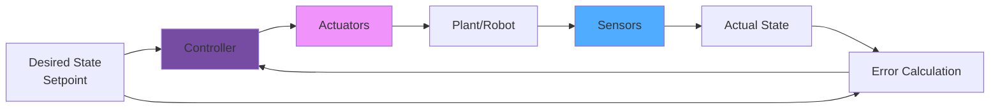

# Control Systems

Control systems are the **decision-making brain** that processes sensor data and commands actuators to achieve desired robot behavior. This chapter explores classical and modern control techniques used in robotics.


## Control System Fundamentals



:::tip Core Concept
**Control systems** continuously adjust actuator outputs to minimize the **error** between desired and actual states.
:::

## Open-Loop vs. Closed-Loop Control

| Feature | Open-Loop | Closed-Loop (Feedback) |
|---------|-----------|------------------------|
| **Uses Feedback** | No | Yes |
| **Accuracy** | Low | High |
| **Complexity** | Simple | Complex |
| **Disturbance Rejection** | Poor | Good |
| **Example** | Timed motor | PID controller |
| **Cost** | Low | Higher |

### Open-Loop Control

```python
class OpenLoopController:
    """Simple open-loop motor control"""

    def __init__(self, motor):
        self.motor = motor

    def move_distance(self, distance_cm, speed=100):
        """Move specified distance without feedback"""
        # Calculate time needed (assuming 10cm/s at 100% speed)
        time_needed = distance_cm / (10 * speed / 100.0)

        print(f"🔓 Open-loop: Moving {distance_cm}cm")
        print(f"   Running motor for {time_needed:.2f}s at {speed}% speed")

        # Command motor
        self.motor.set_speed(speed)
        time.sleep(time_needed)
        self.motor.stop()

        print(f"✅ Command complete (actual distance may vary!)")

# Usage - no guarantee of accuracy!
motor = DCMotor(pwm_pin=12, dir_pin1=16, dir_pin2=18)
controller = OpenLoopController(motor)
controller.move_distance(distance_cm=50, speed=80)
```

### Closed-Loop Control

```python
class ClosedLoopController:
    """Closed-loop control with encoder feedback"""

    def __init__(self, motor, encoder):
        self.motor = motor
        self.encoder = encoder

    def move_distance(self, target_distance, max_speed=100):
        """Move to target distance using feedback"""
        print(f"🔒 Closed-loop: Moving to {target_distance}cm")

        while True:
            # Read current position
            current_position = self.encoder.read_position()
            error = target_distance - current_position

            print(f"   Position: {current_position:.1f}cm, Error: {error:.1f}cm")

            # Check if reached
            if abs(error) < 0.5:  # 5mm tolerance
                self.motor.stop()
                print(f"✅ Target reached: {current_position:.1f}cm")
                break

            # Calculate speed based on error
            speed = min(max_speed, abs(error) * 10)  # Proportional control
            speed = max(20, speed)  # Minimum speed

            # Set motor direction and speed
            if error > 0:
                self.motor.set_speed(speed)
            else:
                self.motor.set_speed(-speed)

            time.sleep(0.05)

# Usage - accurate positioning!
encoder = RotaryEncoder(pin_a=20, pin_b=21)
controller = ClosedLoopController(motor, encoder)
controller.move_distance(target_distance=50.0)
```

## PID Controllers

**PID = Proportional + Integral + Derivative**

The most widely used controller in robotics!

### PID Components

| Term | Purpose | Effect | Problem it Solves |
|------|---------|--------|-------------------|
| **P (Proportional)** | React to current error | Immediate response | Slow convergence |
| **I (Integral)** | React to accumulated error | Eliminates steady-state error | Offset/bias |
| **D (Derivative)** | React to rate of change | Reduces overshoot | Oscillation |

### Complete PID Implementation

```python
import time

class PIDController:
    """Full-featured PID controller"""

    def __init__(self, kp, ki, kd, setpoint=0):
        # Gains
        self.kp = kp  # Proportional gain
        self.ki = ki  # Integral gain
        self.kd = kd  # Derivative gain

        # Target
        self.setpoint = setpoint

        # State variables
        self.prev_error = 0
        self.integral = 0
        self.prev_time = time.time()

        # Limits
        self.output_min = -100
        self.output_max = 100
        self.integral_min = -50
        self.integral_max = 50

    def compute(self, measured_value):
        """Compute PID output"""
        current_time = time.time()
        dt = current_time - self.prev_time

        # Calculate error
        error = self.setpoint - measured_value

        # Proportional term
        p_term = self.kp * error

        # Integral term (with anti-windup)
        self.integral += error * dt
        self.integral = max(self.integral_min,
                           min(self.integral_max, self.integral))
        i_term = self.ki * self.integral

        # Derivative term
        if dt > 0:
            derivative = (error - self.prev_error) / dt
        else:
            derivative = 0
        d_term = self.kd * derivative

        # Calculate total output
        output = p_term + i_term + d_term

        # Clamp output
        output = max(self.output_min, min(self.output_max, output))

        # Update state
        self.prev_error = error
        self.prev_time = current_time

        # Debug output
        print(f"PID: SP={self.setpoint:.1f}, PV={measured_value:.1f}, "
              f"E={error:.2f}, P={p_term:.2f}, I={i_term:.2f}, "
              f"D={d_term:.2f}, Out={output:.2f}")

        return output

    def set_setpoint(self, setpoint):
        """Update target setpoint"""
        self.setpoint = setpoint
        self.integral = 0  # Reset integral on setpoint change

    def reset(self):
        """Reset controller state"""
        self.prev_error = 0
        self.integral = 0
        self.prev_time = time.time()

# Example: Temperature control
pid = PIDController(kp=2.0, ki=0.5, kd=1.0, setpoint=25.0)

for _ in range(20):
    current_temp = read_temperature()  # Simulated
    heater_power = pid.compute(current_temp)
    set_heater(heater_power)
    time.sleep(0.1)
```

### PID Tuning Guide

```python
class PIDTuner:
    """Helper for PID tuning"""

    @staticmethod
    def ziegler_nichols_method():
        """Ziegler-Nichols tuning rules"""
        print("\n🎛️ Ziegler-Nichols PID Tuning Method")
        print("="*50)
        print("\nStep 1: Set Ki=0, Kd=0")
        print("Step 2: Increase Kp until sustained oscillation")
        print("Step 3: Note Ku (ultimate gain) and Tu (period)")
        print("\nFor PID Controller:")
        print("  Kp = 0.6 * Ku")
        print("  Ki = 2 * Kp / Tu")
        print("  Kd = Kp * Tu / 8")

        # Example calculation
        Ku = float(input("\nEnter Ultimate Gain (Ku): "))
        Tu = float(input("Enter Oscillation Period (Tu): "))

        kp = 0.6 * Ku
        ki = 2 * kp / Tu
        kd = kp * Tu / 8

        print(f"\n✅ Recommended PID values:")
        print(f"   Kp = {kp:.3f}")
        print(f"   Ki = {ki:.3f}")
        print(f"   Kd = {kd:.3f}")

        return kp, ki, kd

    @staticmethod
    def manual_tuning_guide():
        """Manual tuning guidelines"""
        print("\n🔧 Manual PID Tuning Guide")
        print("="*50)

        guidelines = {
            "Too much overshoot": "Increase Kd, decrease Kp",
            "Slow response": "Increase Kp",
            "Steady-state error": "Increase Ki",
            "Oscillation": "Decrease Kp, increase Kd",
            "Unstable": "Reduce all gains, start over"
        }

        for problem, solution in guidelines.items():
            print(f"  {problem:20s} → {solution}")
```

## Line Following with PID

```python
class LineFollowingRobot:
    """Line follower with PID control"""

    def __init__(self):
        # Hardware
        self.sensors = [IRSensor(pin=i) for i in range(5)]
        self.motor_left = DCMotor(pwm_pin=12, dir_pin1=16, dir_pin2=18)
        self.motor_right = DCMotor(pwm_pin=13, dir_pin1=19, dir_pin2=20)

        # PID controller for steering
        self.pid = PIDController(kp=30, ki=0, kd=15, setpoint=0)

        # Parameters
        self.base_speed = 60

    def read_line_position(self):
        """Calculate line position (-100 to +100)"""
        readings = [s.read() for s in self.sensors]
        weights = [-100, -50, 0, 50, 100]

        # Weighted average
        if sum(readings) > 0:
            position = sum(r * w for r, w in zip(readings, weights)) / sum(readings)
        else:
            position = 0

        return position

    def follow_line(self):
        """Main line following loop"""
        print("🚗 Starting line follower with PID...")

        while True:
            # Read sensor
            line_position = self.read_line_position()

            # PID control
            steering = self.pid.compute(line_position)

            # Calculate motor speeds
            left_speed = self.base_speed + steering
            right_speed = self.base_speed - steering

            # Constrain speeds
            left_speed = max(-100, min(100, left_speed))
            right_speed = max(-100, min(100, right_speed))

            # Set motors
            self.motor_left.set_speed(left_speed)
            self.motor_right.set_speed(right_speed)

            print(f"Pos: {line_position:6.1f}, Steer: {steering:6.1f}, "
                  f"L: {left_speed:5.1f}, R: {right_speed:5.1f}")

            time.sleep(0.05)

# Run
robot = LineFollowingRobot()
robot.follow_line()
```

## State Machines

Organize complex robot behaviors:

```python
from enum import Enum

class RobotState(Enum):
    IDLE = 0
    SEARCHING = 1
    APPROACHING = 2
    GRASPING = 3
    RETURNING = 4
    ERROR = 5

class StateMachineRobot:
    """Robot controlled by state machine"""

    def __init__(self):
        self.state = RobotState.IDLE
        self.target_detected = False
        self.object_grasped = False

    def run(self):
        """Main state machine loop"""
        print("🤖 State machine robot started\n")

        while True:
            print(f"Current State: {self.state.name}")

            if self.state == RobotState.IDLE:
                self.handle_idle()

            elif self.state == RobotState.SEARCHING:
                self.handle_searching()

            elif self.state == RobotState.APPROACHING:
                self.handle_approaching()

            elif self.state == RobotState.GRASPING:
                self.handle_grasping()

            elif self.state == RobotState.RETURNING:
                self.handle_returning()

            elif self.state == RobotState.ERROR:
                self.handle_error()

            time.sleep(0.5)

    def handle_idle(self):
        """Idle state - wait for start command"""
        print("  Waiting for start command...")
        # Transition to searching
        self.state = RobotState.SEARCHING

    def handle_searching(self):
        """Search for target object"""
        print("  Scanning for objects...")

        # Simulate object detection
        import random
        if random.random() > 0.7:
            self.target_detected = True
            print("  ✅ Object detected!")
            self.state = RobotState.APPROACHING
        else:
            print("  🔍 Still searching...")

    def handle_approaching(self):
        """Approach detected object"""
        print("  Moving towards object...")

        # Simulate approach
        time.sleep(1)
        print("  ✅ Reached object")
        self.state = RobotState.GRASPING

    def handle_grasping(self):
        """Grasp the object"""
        print("  Attempting to grasp...")

        # Simulate grasp
        import random
        if random.random() > 0.3:
            self.object_grasped = True
            print("  ✅ Object grasped!")
            self.state = RobotState.RETURNING
        else:
            print("  ❌ Grasp failed!")
            self.state = RobotState.ERROR

    def handle_returning(self):
        """Return to home position"""
        print("  Returning to home...")
        time.sleep(1)
        print("  ✅ Mission complete!")
        self.state = RobotState.IDLE
        self.object_grasped = False

    def handle_error(self):
        """Handle error conditions"""
        print("  ⚠️ Error state - recovering...")
        time.sleep(2)
        self.state = RobotState.IDLE

# Run state machine
robot = StateMachineRobot()
robot.run()
```

## Motion Planning

### Path Planning with A* Algorithm

```python
import heapq
import math

class PathPlanner:
    """A* path planning for grid navigation"""

    def __init__(self, grid):
        self.grid = grid  # 2D array: 0=free, 1=obstacle
        self.height = len(grid)
        self.width = len(grid[0]) if grid else 0

    def plan_path(self, start, goal):
        """Find shortest path from start to goal"""
        print(f"🗺️ Planning path from {start} to {goal}")

        # A* algorithm
        open_set = []
        heapq.heappush(open_set, (0, start))

        came_from = {}
        g_score = {start: 0}
        f_score = {start: self.heuristic(start, goal)}

        while open_set:
            current = heapq.heappop(open_set)[1]

            if current == goal:
                path = self.reconstruct_path(came_from, current)
                print(f"✅ Path found! Length: {len(path)}")
                return path

            for neighbor in self.get_neighbors(current):
                tentative_g = g_score[current] + 1

                if neighbor not in g_score or tentative_g < g_score[neighbor]:
                    came_from[neighbor] = current
                    g_score[neighbor] = tentative_g
                    f_score[neighbor] = tentative_g + self.heuristic(neighbor, goal)
                    heapq.heappush(open_set, (f_score[neighbor], neighbor))

        print("❌ No path found!")
        return None

    def heuristic(self, a, b):
        """Euclidean distance heuristic"""
        return math.sqrt((a[0] - b[0])**2 + (a[1] - b[1])**2)

    def get_neighbors(self, pos):
        """Get valid neighboring cells"""
        neighbors = []
        x, y = pos

        for dx, dy in [(-1,0), (1,0), (0,-1), (0,1)]:
            nx, ny = x + dx, y + dy

            if (0 <= nx < self.width and
                0 <= ny < self.height and
                self.grid[ny][nx] == 0):
                neighbors.append((nx, ny))

        return neighbors

    def reconstruct_path(self, came_from, current):
        """Reconstruct path from came_from dict"""
        path = [current]
        while current in came_from:
            current = came_from[current]
            path.append(current)
        path.reverse()
        return path

# Example usage
grid = [
    [0, 0, 0, 1, 0, 0],
    [0, 1, 0, 1, 0, 0],
    [0, 1, 0, 0, 0, 0],
    [0, 0, 0, 1, 1, 0],
    [0, 0, 0, 0, 0, 0]
]

planner = PathPlanner(grid)
path = planner.plan_path(start=(0, 0), goal=(5, 4))
print(f"Path: {path}")
```

## Trajectory Generation

```python
class TrajectoryGenerator:
    """Generate smooth motion trajectories"""

    @staticmethod
    def linear_trajectory(start, end, duration, dt=0.01):
        """Generate linear trajectory"""
        steps = int(duration / dt)
        trajectory = []

        for i in range(steps + 1):
            t = i / steps
            position = start + (end - start) * t
            velocity = (end - start) / duration

            trajectory.append({
                'time': i * dt,
                'position': position,
                'velocity': velocity
            })

        return trajectory

    @staticmethod
    def trapezoidal_trajectory(start, end, max_vel, accel):
        """Generate trapezoidal velocity profile"""
        distance = abs(end - start)
        direction = 1 if end > start else -1

        # Calculate trajectory phases
        t_accel = max_vel / accel
        d_accel = 0.5 * accel * t_accel**2

        if 2 * d_accel >= distance:
            # Triangle profile (no constant velocity)
            t_accel = math.sqrt(distance / accel)
            max_vel = accel * t_accel
            t_const = 0
        else:
            # Trapezoidal profile
            t_const = (distance - 2 * d_accel) / max_vel

        t_total = 2 * t_accel + t_const

        print(f"📈 Trajectory: accel={t_accel:.2f}s, "
              f"const={t_const:.2f}s, total={t_total:.2f}s")

        return {
            'total_time': t_total,
            'accel_time': t_accel,
            'const_time': t_const,
            'max_velocity': max_vel * direction
        }

# Example
traj = TrajectoryGenerator()
profile = traj.trapezoidal_trajectory(
    start=0, end=100,
    max_vel=50, accel=20
)
```

## What's Next?

In **Chapter 6**, we'll explore **AI Techniques for Robotics**:
- Machine learning for perception
- Reinforcement learning for control
- Computer vision
- Neural networks

---

**Continue Learning** → [Chapter 6: AI Techniques →](/docs/chapter6-ai-techniques)
