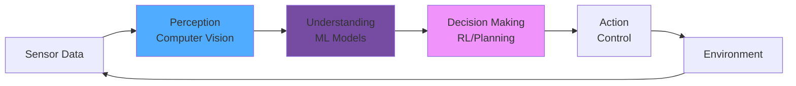

# AI Techniques for Robotics

Modern robots leverage **artificial intelligence** to perceive, learn, and make decisions autonomously. This chapter explores machine learning, computer vision, and neural network techniques that power intelligent physical systems.


## AI in Robotics Pipeline



:::tip Core Insight
AI enables robots to **learn from experience** rather than being explicitly programmed for every scenario.
:::

---

# Part 1: Machine Learning

## Supervised Learning

Training models with labeled data for classification and regression tasks.

### Object Classification

```python
import numpy as np

class SimpleNeuralNetwork:
    """Basic neural network for object classification"""

    def __init__(self, input_size, hidden_size, output_size):
        # Initialize weights randomly
        self.W1 = np.random.randn(input_size, hidden_size) * 0.01
        self.b1 = np.zeros((1, hidden_size))
        self.W2 = np.random.randn(hidden_size, output_size) * 0.01
        self.b2 = np.zeros((1, output_size))

    def sigmoid(self, x):
        """Sigmoid activation function"""
        return 1 / (1 + np.exp(-x))

    def softmax(self, x):
        """Softmax for multi-class classification"""
        exp_x = np.exp(x - np.max(x, axis=1, keepdims=True))
        return exp_x / np.sum(exp_x, axis=1, keepdims=True)

    def forward(self, X):
        """Forward propagation"""
        # Hidden layer
        self.z1 = np.dot(X, self.W1) + self.b1
        self.a1 = self.sigmoid(self.z1)

        # Output layer
        self.z2 = np.dot(self.a1, self.W2) + self.b2
        self.a2 = self.softmax(self.z2)

        return self.a2

    def train(self, X, y, epochs=1000, learning_rate=0.01):
        """Train the network"""
        print(f"🎓 Training neural network...")
        print(f"   Epochs: {epochs}, Learning rate: {learning_rate}")

        for epoch in range(epochs):
            # Forward pass
            output = self.forward(X)

            # Calculate loss
            loss = -np.mean(y * np.log(output + 1e-8))

            # Backward pass (gradient descent)
            dz2 = output - y
            dW2 = np.dot(self.a1.T, dz2) / len(X)
            db2 = np.mean(dz2, axis=0, keepdims=True)

            da1 = np.dot(dz2, self.W2.T)
            dz1 = da1 * self.a1 * (1 - self.a1)
            dW1 = np.dot(X.T, dz1) / len(X)
            db1 = np.mean(dz1, axis=0, keepdims=True)

            # Update weights
            self.W1 -= learning_rate * dW1
            self.b1 -= learning_rate * db1
            self.W2 -= learning_rate * dW2
            self.b2 -= learning_rate * db2

            if epoch % 100 == 0:
                accuracy = np.mean(np.argmax(output, axis=1) == np.argmax(y, axis=1))
                print(f"   Epoch {epoch:4d}: Loss={loss:.4f}, Acc={accuracy:.2%}")

        print("✅ Training complete!")

    def predict(self, X):
        """Make predictions"""
        output = self.forward(X)
        return np.argmax(output, axis=1)

# Example: Classify objects from sensor data
nn = SimpleNeuralNetwork(input_size=10, hidden_size=20, output_size=3)

# Training data (simulated sensor readings)
X_train = np.random.randn(100, 10)
y_train = np.eye(3)[np.random.choice(3, 100)]  # One-hot encoded labels

nn.train(X_train, y_train, epochs=500)

# Test prediction
X_test = np.random.randn(5, 10)
predictions = nn.predict(X_test)
print(f"\n🎯 Predictions: {predictions}")
```

## Reinforcement Learning

Learning through trial and error with rewards.

### Q-Learning for Navigation

```python
import numpy as np
import random

class QLearningRobot:
    """Q-Learning agent for grid navigation"""

    def __init__(self, grid_size, n_actions=4):
        self.grid_size = grid_size
        self.n_actions = n_actions  # Up, Down, Left, Right

        # Q-table: state -> action values
        self.q_table = np.zeros((grid_size, grid_size, n_actions))

        # Hyperparameters
        self.learning_rate = 0.1
        self.discount_factor = 0.95
        self.epsilon = 1.0  # Exploration rate
        self.epsilon_decay = 0.995
        self.epsilon_min = 0.01

    def choose_action(self, state):
        """Epsilon-greedy action selection"""
        if random.random() < self.epsilon:
            # Explore: random action
            return random.randint(0, self.n_actions - 1)
        else:
            # Exploit: best known action
            x, y = state
            return np.argmax(self.q_table[x, y, :])

    def learn(self, state, action, reward, next_state):
        """Update Q-value"""
        x, y = state
        nx, ny = next_state

        # Current Q-value
        current_q = self.q_table[x, y, action]

        # Maximum Q-value for next state
        max_next_q = np.max(self.q_table[nx, ny, :])

        # Q-learning update
        new_q = current_q + self.learning_rate * (
            reward + self.discount_factor * max_next_q - current_q
        )

        self.q_table[x, y, action] = new_q

    def train(self, environment, episodes=1000):
        """Train the agent"""
        print(f"🎮 Training Q-Learning agent for {episodes} episodes...")

        for episode in range(episodes):
            state = environment.reset()
            total_reward = 0
            steps = 0

            while not environment.is_terminal(state) and steps < 100:
                # Choose action
                action = self.choose_action(state)

                # Take action
                next_state, reward = environment.step(state, action)

                # Learn from experience
                self.learn(state, action, reward, next_state)

                total_reward += reward
                state = next_state
                steps += 1

            # Decay exploration
            self.epsilon = max(self.epsilon_min, self.epsilon * self.epsilon_decay)

            if episode % 100 == 0:
                print(f"   Episode {episode:4d}: Reward={total_reward:6.2f}, "
                      f"ε={self.epsilon:.3f}")

        print("✅ Training complete!")

# Simple grid environment
class GridEnvironment:
    def __init__(self, size=5):
        self.size = size
        self.goal = (size-1, size-1)

    def reset(self):
        return (0, 0)

    def step(self, state, action):
        x, y = state

        # Move based on action
        if action == 0:  # Up
            x = max(0, x - 1)
        elif action == 1:  # Down
            x = min(self.size - 1, x + 1)
        elif action == 2:  # Left
            y = max(0, y - 1)
        elif action == 3:  # Right
            y = min(self.size - 1, y + 1)

        next_state = (x, y)

        # Reward
        if next_state == self.goal:
            reward = 100  # Goal reached!
        else:
            reward = -1  # Small penalty for each step

        return next_state, reward

    def is_terminal(self, state):
        return state == self.goal

# Train agent
env = GridEnvironment(size=5)
agent = QLearningRobot(grid_size=5)
agent.train(env, episodes=500)
```

---

# Part 2: Computer Vision

## Image Processing

```python
class ImageProcessor:
    """Basic image processing for robotics"""

    @staticmethod
    def rgb_to_grayscale(image):
        """Convert RGB to grayscale"""
        # Weighted average: 0.299R + 0.587G + 0.114B
        gray = (0.299 * image[:,:,0] +
                0.587 * image[:,:,1] +
                0.114 * image[:,:,2])
        return gray.astype(np.uint8)

    @staticmethod
    def edge_detection(image):
        """Simple edge detection using Sobel operator"""
        import numpy as np

        # Sobel kernels
        kernel_x = np.array([[-1, 0, 1],
                            [-2, 0, 2],
                            [-1, 0, 1]])

        kernel_y = np.array([[-1, -2, -1],
                            [ 0,  0,  0],
                            [ 1,  2,  1]])

        # Convolve (simplified - no padding)
        h, w = image.shape
        edges = np.zeros_like(image)

        for i in range(1, h-1):
            for j in range(1, w-1):
                gx = np.sum(kernel_x * image[i-1:i+2, j-1:j+2])
                gy = np.sum(kernel_y * image[i-1:i+2, j-1:j+2])
                edges[i, j] = np.sqrt(gx**2 + gy**2)

        return edges

    @staticmethod
    def threshold(image, threshold_value=128):
        """Binary thresholding"""
        binary = np.where(image > threshold_value, 255, 0)
        return binary.astype(np.uint8)

    @staticmethod
    def find_contours(binary_image):
        """Find object contours"""
        contours = []
        # Simplified contour detection
        # Real implementation would use more sophisticated algorithms
        print(f"📐 Found contours in image")
        return contours

# Usage
processor = ImageProcessor()
# gray = processor.rgb_to_grayscale(image)
# edges = processor.edge_detection(gray)
# binary = processor.threshold(edges)
```

## Object Detection

```python
class ObjectDetector:
    """Simple object detection system"""

    def __init__(self):
        self.objects = {
            'red_ball': {'color_range': ([0, 100, 100], [10, 255, 255])},
            'blue_cube': {'color_range': ([100, 100, 100], [130, 255, 255])},
        }

    def detect_color_object(self, image, object_type):
        """Detect object by color"""
        print(f"🔍 Detecting {object_type}...")

        if object_type not in self.objects:
            print(f"❌ Unknown object type: {object_type}")
            return None

        # Color range for this object
        lower, upper = self.objects[object_type]['color_range']

        # Create mask (simplified - assuming HSV image)
        # In real implementation:
        # - Convert RGB to HSV
        # - Apply cv2.inRange()
        # - Find contours
        # - Calculate bounding box

        # Simulated detection
        detection = {
            'found': True,
            'position': (320, 240),  # Center of image
            'bounding_box': (280, 200, 360, 280),
            'confidence': 0.85
        }

        if detection['found']:
            print(f"✅ Found {object_type} at {detection['position']} "
                  f"(confidence: {detection['confidence']:.0%})")

        return detection

    def track_object(self, detections):
        """Track object across frames"""
        if len(detections) < 2:
            return None

        # Calculate velocity
        dx = detections[-1]['position'][0] - detections[-2]['position'][0]
        dy = detections[-1]['position'][1] - detections[-2]['position'][1]

        velocity = (dx, dy)

        # Predict next position
        next_x = detections[-1]['position'][0] + dx
        next_y = detections[-1]['position'][1] + dy

        print(f"📍 Object moving at velocity: {velocity}")
        print(f"   Predicted next position: ({next_x}, {next_y})")

        return (next_x, next_y)

# Usage
detector = ObjectDetector()
detection = detector.detect_color_object(image=None, object_type='red_ball')
```

## Face Recognition

```python
class FaceRecognizer:
    """Simple face recognition system"""

    def __init__(self):
        self.known_faces = {}
        self.face_encodings = []

    def extract_features(self, face_image):
        """Extract facial features (simplified)"""
        # In real system: use deep learning (FaceNet, etc.)
        # Return 128D or 512D feature vector
        features = np.random.randn(128)  # Simulated
        return features

    def register_face(self, name, face_image):
        """Register a new face"""
        print(f"📸 Registering face for: {name}")

        features = self.extract_features(face_image)
        self.known_faces[name] = features

        print(f"✅ Registered {name}")

    def recognize(self, face_image, threshold=0.6):
        """Recognize face from image"""
        features = self.extract_features(face_image)

        best_match = None
        min_distance = float('inf')

        # Compare with known faces
        for name, known_features in self.known_faces.items():
            # Euclidean distance
            distance = np.linalg.norm(features - known_features)

            if distance < min_distance:
                min_distance = distance
                best_match = name

        # Check if match is good enough
        if min_distance < threshold:
            confidence = 1 - (min_distance / threshold)
            print(f"✅ Recognized: {best_match} "
                  f"(confidence: {confidence:.0%})")
            return best_match, confidence
        else:
            print(f"❓ Unknown person")
            return None, 0

# Usage
recognizer = FaceRecognizer()
# recognizer.register_face("Alice", alice_face_image)
# recognizer.register_face("Bob", bob_face_image)
# name, confidence = recognizer.recognize(unknown_face)
```

---

# Part 3: Deep Learning for Robotics

## Convolutional Neural Networks (CNN)

```python
class SimpleCNN:
    """CNN for visual perception"""

    def __init__(self):
        self.layers = []

    def conv2d(self, input, kernel, stride=1):
        """2D convolution operation"""
        h, w = input.shape
        kh, kw = kernel.shape

        output_h = (h - kh) // stride + 1
        output_w = (w - kw) // stride + 1

        output = np.zeros((output_h, output_w))

        for i in range(0, output_h, stride):
            for j in range(0, output_w, stride):
                region = input[i:i+kh, j:j+kw]
                output[i//stride, j//stride] = np.sum(region * kernel)

        return output

    def max_pool(self, input, pool_size=2):
        """Max pooling operation"""
        h, w = input.shape
        output_h = h // pool_size
        output_w = w // pool_size

        output = np.zeros((output_h, output_w))

        for i in range(output_h):
            for j in range(output_w):
                region = input[i*pool_size:(i+1)*pool_size,
                             j*pool_size:(j+1)*pool_size]
                output[i, j] = np.max(region)

        return output

    def forward(self, image):
        """Forward pass through CNN"""
        # Convolution layer
        kernel = np.array([[-1, -1, -1],
                          [-1,  8, -1],
                          [-1, -1, -1]])  # Edge detection kernel

        conv_output = self.conv2d(image, kernel)
        print(f"Conv output shape: {conv_output.shape}")

        # Activation (ReLU)
        activated = np.maximum(0, conv_output)

        # Max pooling
        pooled = self.max_pool(activated)
        print(f"Pooled output shape: {pooled.shape}")

        return pooled

# Example usage
cnn = SimpleCNN()
# image = np.random.rand(64, 64)
# features = cnn.forward(image)
```

## Transfer Learning

```python
class TransferLearning:
    """Use pre-trained models for robotics tasks"""

    def __init__(self, base_model='ResNet50'):
        self.base_model = base_model
        self.custom_layers = []

    def load_pretrained(self):
        """Load pre-trained model"""
        print(f"📥 Loading pre-trained {self.base_model}...")
        # In real implementation: load from file or library
        print(f"✅ Model loaded")

    def add_custom_layers(self, n_classes):
        """Add task-specific layers"""
        print(f"🔧 Adding custom layers for {n_classes} classes...")

        # In real implementation:
        # - Freeze base model layers
        # - Add new classification head
        # - Compile model

        print(f"✅ Custom layers added")

    def fine_tune(self, training_data, epochs=10):
        """Fine-tune on robot-specific data"""
        print(f"🎓 Fine-tuning model...")

        for epoch in range(epochs):
            # Training step
            loss = np.random.random()  # Simulated
            accuracy = 0.5 + epoch * 0.04  # Simulated improvement

            print(f"   Epoch {epoch+1}/{epochs}: "
                  f"Loss={loss:.4f}, Acc={accuracy:.2%}")

        print(f"✅ Fine-tuning complete!")

# Usage for robot object recognition
tl = TransferLearning(base_model='ResNet50')
tl.load_pretrained()
tl.add_custom_layers(n_classes=10)
# tl.fine_tune(robot_training_data, epochs=20)
```

## 🎯 Complete AI Vision System

```python
class RobotVisionAI:
    """Complete AI vision system for robots"""

    def __init__(self):
        self.detector = ObjectDetector()
        self.recognizer = FaceRecognizer()
        self.processor = ImageProcessor()

    def process_frame(self, image):
        """Process single camera frame"""
        results = {
            'objects': [],
            'faces': [],
            'scene_info': {}
        }

        # 1. Image preprocessing
        gray = self.processor.rgb_to_grayscale(image)

        # 2. Object detection
        for obj_type in ['red_ball', 'blue_cube']:
            detection = self.detector.detect_color_object(image, obj_type)
            if detection and detection['found']:
                results['objects'].append({
                    'type': obj_type,
                    'position': detection['position'],
                    'confidence': detection['confidence']
                })

        # 3. Face recognition
        # faces = detect_faces(image)
        # for face in faces:
        #     name, conf = self.recognizer.recognize(face)
        #     results['faces'].append({'name': name, 'confidence': conf})

        # 4. Scene understanding
        results['scene_info'] = {
            'brightness': np.mean(gray),
            'n_objects': len(results['objects']),
            'n_faces': len(results['faces'])
        }

        return results

    def make_decision(self, vision_results):
        """Make decision based on vision"""
        print(f"\n🧠 Making decision based on vision...")

        if vision_results['objects']:
            obj = vision_results['objects'][0]
            print(f"   Found {obj['type']} at {obj['position']}")
            return f"APPROACH_{obj['type'].upper()}"

        elif vision_results['faces']:
            face = vision_results['faces'][0]
            print(f"   Recognized {face['name']}")
            return f"GREET_{face['name'].upper()}"

        else:
            print(f"   No objects or faces detected")
            return "EXPLORE"

# Usage
vision_ai = RobotVisionAI()
# results = vision_ai.process_frame(camera.capture())
# action = vision_ai.make_decision(results)
```

## What's Next?

In **Chapter 7**, we'll explore **Real-World Applications**:
- Healthcare robotics
- Industrial automation
- Autonomous vehicles
- Service robots

---

**Continue Learning** → [Chapter 7: Applications →](/docs/chapter7-applications)
